# 司马光综合思维 · 方法神经网络 v3.1（2026-08-11）

一百六十七本书及法律文本的方法加上 ds-vision-skill 视觉输入通道，按 64 个节点、223 条边连接，通过**支撑、验证、辩证**三种关系协同工作，最后输出综合分析与可执行建议。

融合运行协议见 `神经网络总纲.md`；本文件保存节点、边、激活规则与机制细节。

相似技能聚类与合并规则见 `技能合并索引.md`；预置表只作基线，实际调用先判断问题结构，再动态激活相关簇，最后回到具体节点取证。

## 输入层 + 四层认知架构

信息按“质检员 → 分析师 → 策略师 → 仲裁官”四层流动，每层完成后必须向下一层输出可验证的结论。

| 层级 | 角色 | 节点 | 职责 |
|---|---|---|---|
| L0 | 视觉输入 | N36 | 用 ds-vision-skill 把摄像头/OCR/图片理解/PDF解析结果统一成文本证据 |
| L1 | 质检员 | N20、N17、N12、N9、N13、N39 | 接收问题，拆解论题、结论、理由、假设、谬误，定义核心概念，核验陈述真实性 |
| L2 | 分析师 | N15、N16、N23、N10、N2、N9、N37、N38、N40、N41、N43、N44、N45、N54、N55、N57、N59 | 并行分析人性、动机、性格、群体心理、影响机制、微表情、身体语言、谎言线索、一般心理机制、才性识人、传统观察框架、媒介社会网络、神话原型、学习方法和对话沟通 |
| L3 | 策略师 | N3、N5、N7、N6、N18、N19、N21、N22、N13、N42、N46、N47、N48、N49、N50、N51、N52、N53、N54、N55、N56、N57、N58、N59、N60、N61、N63、N64 | 推演策略、权谋变量、系统连锁反应、规模边界、执行路径、厚黑防御、环境空间、系统控制、科技演化、领导变革、媒介传播、英雄旅程、文明演化、学习方法、未来社会、对话沟通、投资市场、法律权益、健康人体系统和网络系统连接 |
| L4 | 仲裁官 | N1、N4、N8、N11 | 用资治通鉴式历史校准，交叉验证所有结论，给出最终仲裁 |

## 强制机制

### 1. 强制互证

- 任何结论必须至少获得一个来自不同层级的独立支持。
- 例如：分析师判断“此人极度自恋”，必须到 L3 用识人与策略节点验证，并到 L4 找相似人物下场。
- 达不到跨层互证的结论，降一级置信度，标“待验证”。

### 2. 强制辩证

- 每个关键策略都必须走“正-反-合”：
  - 正题：主策略，如“速战速决”；
  - 反题：至少一个不同层级的反对，如老子“不敢为主而为客”、鬼谷子“待时而动”；
  - 合题：由 L4 仲裁官按阶段、身份、目标、尺度、边界、代价收敛。
- 最终输出必须包含一条与主流观点相反的辩证视角。

### 3. 动态权重

| 问题类型 | L1 质检 | L2 分析 | L3 策略 | L4 仲裁 |
|---|---|---|---|---|
| 国家政策 | 10% | 10% | 30% | 50% |
| 商业竞争 | 10% | 30% | 40% | 20% |
| 用人识人 | 10% | 45% | 20% | 25% |
| 亲密关系 | 5% | 45% | 15% | 35% |
| 危机处置 | 10% | 20% | 40% | 30% |
| 创新与复杂 | 15% | 15% | 50% | 20% |

权重用于决定“哪层结论优先”，不用于压制低权重层的反证。

### 4. 压力测试

每次最终输出前，强制追加：

> 请特别注意，最后必须提供一条与上述主流观点完全相反的辩证视角，并用历史案例佐证。

### 5. 高生产力场景路由

| 场景 | 结构入口 | 核心检查 |
|---|---|---|
| 产品路演 12 页 | 高生产力场景模板 | 一页一结论，数据标来源，封底有行动 |
| 项目策划 | 高生产力场景模板 | 主备路径、预算、风险、复查指标闭环 |
| 招标应标 | 高生产力场景模板 | 评分标准反推，先清废标，再争方案分 |
| 论文答辩 | 高生产力场景模板 | 方法、数据、结论对应，预判评审质疑 |
| 辩词 | 高生产力场景模板 | 定义、判准、独立论点、最强反方 |
| 商业计划书 | 高生产力场景模板 | 痛点、方案、壁垒、回报闭环 |
| 小说/剧本/正文 | 小说剧本融合创作协议 + 高生产力场景模板 | 高概念、人物弧光、知识校准、视觉转换、分卷分幕、正文检查、AI提示词、成稿合规、背书来源 |
| 非虚构写作/编辑审稿 | 非虚构写作指南 + 高生产力场景模板 | 事实边界、选题价值、采访素材、叙事结构、语言清理、修改工艺 |
| 文笔/修辞/写作修改 | 写作工艺四书 | 多读多写、工具箱、辞格选择、文章病院、比喻、节奏、收束 |
| 文案/商务逻辑/剧本/深度报道 | 写作文案剧本进阶 | 标题与销售、SCQOR与金字塔、三幕与节拍表、前提与角色、采访叙事 |
| 修订/风格/语感 | 写作修改与风格二书 | 宏观微观修订、自我编辑清单、古典风格、名词化、旧新信息、句法树 |
| 发布前合规/出版流程/读者反馈 | 写作反馈与平台规范协议 | 平台规范、原创/AI/来源标注、三审三校、编辑改稿判断、弃读点、反馈数据分级 |
| 影视/摄影/AI短剧 | 小说剧本融合创作协议 + 影视摄影与短片蒸馏 + AI影视工具与提示词协议 + 电影艺术：形式与风格 + AIGC提示词美学定义 + 镜头的语法 + 电影人之眼 + 秒懂AI提问 + 剪辑的语法 | 剧本结构、十五节拍、视听语法、摄影构图、景别家族、三分构图法、希氏构图法、画面体系、关系镜头、建置/主观镜头、特殊镜头、180度法则、视线匹配、覆盖镜头、动态镜头、剪辑声音、电影形式系统、故事与情节、风格四步、类型、纪录片/实验/动画、电影批评、电影史、美学定义三要素、光与材质、艺术流派、插画、游戏、人物形象、流行趋势、提示词结构、权重参数、效果验证、AI提问方法组合、小说剧本美学转换、AI短剧提示词增强、剪辑基础、转场分类、连贯性、对话剪辑、声轨优先、AI短剧流程、MiniMax H3、Seedance 2.5、角色一致性、平台合规 |

### 6. 蒸馏方法论强化路由

| 场景 | 结构入口 | 核心检查 |
|---|---|---|
| knowledge/books/ | 蒸馏方法论强化技能包 | 先判痛点、建结构、抓核心概念、原文与评论分离、R/I/A1/E/B、归簇、边界、测试、旧新对照 |

## 角色轮值与三方会诊

重大决策启用四个固定角色并行输出：

| 角色 | 对应节点 | 职责 |
|---|---|---|
| 司马光（仲裁官） | L4 / N1、N28 | 最终历史校验与综合仲裁 |
| 韩非子（冷酷效率官） | N25 | 止损、防奸、赏罚、内部风险 |
| 王阳明（政委 / 士气官） | N31 | 心性、感召、绝境韧性、灵活破局 |
| 诸葛亮（参谋长） | N32 | 执行、调度、纪律、落地可行性 |

### 三方会诊协议

1. 并行输出韩非子方案（冷酷效率版）、王阳明方案（灵活感召版）、司马光方案（稳妥历史版）。
2. 诸葛亮评估三版落地可行性：资源、时间、执行链、风险。
3. 司马光仲裁官综合最终建议，并给出相反辩证视角。

### 输出模板

【韩非子方案】冷酷效率版
【王阳明方案】灵活感召版
【司马光方案】稳妥历史版
【诸葛亮落地评估】
【最终仲裁建议】
【相反辩证视角】

边界：韩非子角色只允许止损、制衡、赏罚和防奸；DeepSeek 原文中的“暗杀、非法离间、脏活”不纳入执行，只做制度性替代。

## 议事规则

### 轮值主席

| 问题类型 | 轮值主席 | 主持原则 |
|---|---|---|
| 历史决策 | 司马光 | 先找历史同构案例（含东周列国志历史演义参考），再定结论 |
| 内部人事/肃清 | 韩非子 | 先止损、防奸、赏罚，再谈信任 |
| 危机心理/士气 | 王阳明 | 先安人心、给感召，再谈执行 |
| 执行落地/调度 | 诸葛亮 | 先算资源、时间、纪律，再谈战略 |
| 经济/宏观 | 亚当·斯密/凯恩斯 | 先看激励、成本、总需求，再谈政策 |

### 发言顺序

1. 轮值主席先定调，明确问题边界。
2. 反方先发言：由持对立视角的角色批判主方案。
3. 其余角色按层级轮流发言，先支撑后补盲区。
4. 主席综合裁决，并执行压力测试。

### 冲突解决协议

- 规则1 证据优先：有史料或数据支持的结论，优先于纯逻辑推演。
- 规则2 历史校验：有《资治通鉴》或《读通鉴论》相似案例时，以历史后果为重要参考。
- 规则3 现实可行性：涉及执行时，以《将苑》《管子》《国富论》的落地评估为准。
- 规则4 终极仲裁：仍无法裁定则由轮值主席裁决，并明确标注“此结论存在争议”。

## 分层输出模板

| 版本 | 长度 | 内容 |
|---|---|---|
| 极简版 | ≤50字 | 核心结论 |
| 标准版 | ~500字 | 结论 + 关键论据 |
| 深度版 | ~2000字 | 全流程分步骤推演 |
| 辩证版 | 不限 | 各模块冲突观点 + 最终仲裁过程 |

## 复盘机制

每次深度分析结束后，强制自我批判：

> 刚才的分析中，哪个模块的观点可能被过度强调了？哪个模块被忽略了？如果重来一次，会如何调整权重？

- 分析结束后把置信度、不确定部分、知识缺口和用户追问/纠正写入 `运行目录/学习记录/学习日志.md`；复盘时运行 `scripts/review_learning_log.py` 生成学习复盘和补充计划。

## 维护机制

- 每季度评估书籍贡献率，低贡献书可归档或替换。
- 维护候选书：《金融炼金术》。
- 外部数据源：实时新闻 API、历史人物数据库、世界银行/国家统计局数据；项目已接入免费热点层（`实时数据接入/scripts/fetch_hot_topics.py`），事实核验见 `references/事实与数据核验协议.md`，量化与追踪见 `references/量化推演与执行追踪协议.md`；无权限时标注“数据待接入”。
- 知识蒸馏日志：见 `references/知识蒸馏日志.md`。
- 自我学习：每周日 10:00 自动化搜索国际/国内热点、社会现象和争议人物话题并复盘；历史事件自学仍可运行 `scripts/self-learn-next.sh`，协议与已学记录见 `references/自我学习日志.md`，事件池见 `references/历史事件库.md`。

## 网络拓扑

```mermaid
graph TD
  N1[N1 信息与兼听]
  N2[N2 用人识人]
  N3[N3 形势时机]
  N4[N4 修身自律]
  N5[N5 刚柔进退]
  N6[N6 治理制度]
  N7[N7 竞争决策]
  N8[N8 心性风险]
  N9[N9 思维认知]
  N10[N10 群体舆论]
  N11[N11 幸福体验]
  N12[N12 哲学思维]
  N13[N13 思维工具箱]
  N14[N14 科学思维]
  N15[N15 人性洞察]
  N16[N16 性与关系]
  N17[N17 哲学实践]
  N18[N18 系统思考]
  N19[N19 规模思维]
  N20[N20 批判性提问]
  N21[N21 管理效能]
  N22[N22 高效习惯]
  N23[N23 影响力]
  N24[N24 逻辑学]
  N25[N25 法家权术]
  N26[N26 纵横谋略]
  N27[N27 博弈策略]
  N28[N28 史论鉴戒]
  N29[N29 经济治理]
  N30[N30 墨家兼爱]
  N31[N31 心学良知]
  N32[N32 将帅智谋]
  N33[N33 国富论经济]
  N34[N34 经济学思维]
  N35[N35 凯恩斯宏观]
  N36[N36 视觉输入]
  N37[N37 表情识别]
  N38[N38 谎言识别]
  N39[N39 测谎实证]
  N40[N40 身体语言]
  N41[N41 心理学与生活]
  N42[N42 厚黑防御]
  N43[N43 才性识人]
  N44[N44 传统相法]
  N45[N45 柳庄相法]
  N46[N46 环境风水]
  N47[N47 居住之道]
  N48[N48 门主灶]
  N49[N49 龙脉地形]
  N50[N50 系统控制]
  N51[N51 信息控制]
  N52[N52 科技演化]
  N53[N53 领导变革]
  N54[N54 媒介传播]
  N55[N55 英雄旅程]
  N56[N56 文明演化]
  N57[N57 学习方法]
  N58[N58 未来社会]
  N59[N59 对话沟通]
  N60[N60 投资与市场]
  N61[N61 法律与权益执行]
  N62[N62 工程与软件实践]
  N63[N63 健康与人体系统]
  N64[N64 网络与系统连接]
  N1 <--> N2
  N2 <--> N3
  N3 <--> N7
  N3 <--> N27
  N7 <--> N13
  N4 <--> N8
  N8 <--> N11
  N11 <--> N16
  N4 <--> N16
  N9 <--> N12
  N12 <--> N13
  N13 <--> N14
  N14 <--> N1
  N9 <--> N10
  N10 <--> N3
  N15 <--> N2
  N15 <--> N10
  N6 <--> N14
  N6 <--> N13
  N12 <--> N17
  N13 <--> N17
  N14 <--> N17
  N14 <--> N18
  N6 <--> N18
  N1 <--> N18
  N18 <--> N19
  N14 <--> N19
  N7 <--> N19
  N20 <--> N12
  N20 <--> N17
  N21 <--> N6
  N21 <--> N7
  N22 <--> N4
  N22 <--> N2
  N23 <--> N10
  N23 <--> N15
  N24 <--> N20
  N24 <--> N17
  N24 <--> N12
  N24 <--> N9
  N25 <--> N6
  N25 <--> N2
  N26 <--> N3
  N26 <--> N7
  N27 <--> N7
  N27 <--> N13
  N28 <--> N1
  N28 <--> N4
  N29 <--> N6
  N29 <--> N19
  N30 <--> N11
  N30 <--> N22
  N31 <--> N4
  N31 <--> N8
  N32 <--> N2
  N32 <--> N5
  N33 <--> N29
  N33 <--> N19
  N34 <--> N33
  N34 <--> N27
  N35 <--> N34
  N35 <--> N18
  N35 <--> N19
  N36 <--> N1
  N36 <--> N9
  N36 <--> N14
  N36 <--> N20
  N37 <--> N2
  N37 <--> N40
  N38 <--> N37
  N38 <--> N39
  N38 <--> N9
  N39 <--> N14
  N41 <--> N9
  N41 <--> N10
  N41 <--> N15
  N41 <--> N16
  N41 <--> N37
  N41 <--> N40
  N41 <--> N39
  N42 <--> N25
  N42 <--> N26
  N42 <--> N27
  N42 <--> N38
  N43 <--> N2
  N43 <--> N9
  N43 <--> N15
  N43 <--> N37
  N44 <--> N2
  N44 <--> N37
  N44 <--> N40
  N44 <--> N43
  N45 <--> N2
  N45 <--> N37
  N45 <--> N40
  N45 <--> N44
  N46 <--> N6
  N46 <--> N14
  N46 <--> N18
  N46 <--> N47
  N47 <--> N6
  N47 <--> N18
  N48 <--> N18
  N48 <--> N46
  N48 <--> N47
  N49 <--> N14
  N49 <--> N18
  N49 <--> N46
  N49 <--> N47
  N50 <--> N1
  N50 <--> N6
  N50 <--> N13
  N50 <--> N14
  N50 <--> N18
  N51 <--> N1
  N51 <--> N9
  N51 <--> N14
  N51 <--> N18
  N51 <--> N50
  N52 <--> N14
  N52 <--> N18
  N52 <--> N19
  N52 <--> N50
  N52 <--> N51
  N53 <--> N2
  N53 <--> N6
  N53 <--> N7
  N53 <--> N8
  N53 <--> N21
  N53 <--> N22
  N53 <--> N31
  N53 <--> N32
  N54 <--> N10
  N54 <--> N14
  N54 <--> N18
  N54 <--> N23
  N54 <--> N41
  N54 <--> N51
  N54 <--> N52
  N55 <--> N8
  N55 <--> N11
  N55 <--> N14
  N55 <--> N15
  N55 <--> N21
  N55 <--> N31
  N55 <--> N41
  N56 <--> N6
  N56 <--> N10
  N56 <--> N14
  N56 <--> N18
  N56 <--> N19
  N56 <--> N28
  N57 <--> N9
  N57 <--> N14
  N57 <--> N21
  N57 <--> N22
  N57 <--> N41
  N58 <--> N9
  N58 <--> N10
  N58 <--> N14
  N58 <--> N34
  N58 <--> N51
  N58 <--> N52
  N59 <--> N16
  N59 <--> N20
  N59 <--> N26
  N59 <--> N31
  N59 <--> N41
  N59 <--> N54
  N60 <--> N9
  N60 <--> N14
  N60 <--> N18
  N60 <--> N19
  N60 <--> N27
  N60 <--> N28
  N60 <--> N33
  N60 <--> N34
  N60 <--> N41
  N60 <--> N8
  N61 <--> N6
  N61 <--> N15
  N61 <--> N29
  N61 <--> N41
  N61 <--> N59
  N61 <--> N60
  N62 <--> N14
  N62 <--> N18
  N62 <--> N21
  N62 <--> N22
  N62 <--> N57
  N63 <--> N18
  N63 <--> N41
  N63 <--> N61
  N63 <--> N16
  N63 <--> N4
  N63 <--> N14
  N64 <--> N18
  N64 <--> N50
  N64 <--> N51
  N64 <--> N52
  N64 <--> N62
  N64 <--> N14
```

## 节点

| 节点 | 名称 | 主要方法来源 |
|---|---|---|
| N1 | 信息与兼听 | 资治通鉴、孙子、鬼谷子、挺经、法医学、侦探推理学习手册、犯罪心理画像、错案追踪、谋杀手段、福尔摩斯探案全集、Criminal Investigation、电子数据取证、刑事科学技术、证据法学、二十四史 |
| N2 | 用人识人 | 资治通鉴、挺经、冰鉴、古文观止、痕迹识人、遥远的救世主、犯罪心理画像、史记文白对照版、二十四史 |
| N3 | 形势时机 | 资治通鉴、孙子、易经、鬼谷子、世界秩序、古文观止、海权论、大国的兴衰、注定一战、史记文白对照版、皇极经世书、梅花易数、增删卜易、揭开帝王的秘籍、遁甲演义、奇门鸣法、金函玉镜奇门遁甲秘笈全书、战争艺术史、战争论、二十四史 |
| N4 | 修身自律 | 挺经、道德经、庄子、弘一法师全集、原子习惯、成功心理学、过得刚好、庄子现代注解、论语、深度工作 |
| N5 | 刚柔进退 | 挺经、道德经、孙子、易经、战争艺术史、战争论 |
| N6 | 治理制度 | 资治通鉴、孙子、挺经、易经、世界秩序、古文观止、算法霸权、变革中国、技术陷阱、海权论、大国的兴衰、注定一战、清单革命、宪法学导论、遥远的救世主、错案追踪、史记文白对照版、证据法学、论语、战争艺术史、战争论、二十四史 |
| N7 | 竞争决策 | 孙子、鬼谷子、道德经、资治通鉴、毛泽东军事文选、遥远的救世主、过得刚好、创新者的窘境、人人都是产品经理2.0、启示录、从0到1、战争艺术史、战争论 |
| N8 | 心性风险 | 庄子、道德经、易经、挺经、弘一法师全集、过得刚好、庄子现代注解、论语 |
| N9 | 思维认知 | 思考好与坏、思考快与慢、世界观、底层逻辑、侦探推理学习手册、犯罪心理画像、谋杀手段、福尔摩斯探案全集、怪诞行为学、刻板印象 |
| N10 | 群体舆论 | 乌合之众、思考快与慢、资治通鉴、疯传与传染、社会心理学、刻板印象 |
| N11 | 幸福体验 | 思考快与慢、思考好与坏、道德经、庄子、过得刚好、庄子现代注解、论语 |
| N12 | 哲学思维 | 哲学思维、世界观、庄子现代注解、易经真的很容易、周易、周易六十四卦浅解、揭开帝王的秘籍 |
| N13 | 思维工具箱 | 50种思维方法、底层逻辑 |
| N14 | 科学思维 | 第一性原理（21堂科学通识课）、第一性原理（李善友）、贝叶斯定理、数据模型与决策、事实、超预测、算法霸权、技术陷阱、世界观、天才与算法、法医学、侦探推理学习手册、犯罪心理画像、错案追踪、谋杀手段、福尔摩斯探案全集、怪诞行为学、Criminal Investigation、电子数据取证、刑事科学技术、证据法学、从0到1、滴天髓征义、皇极经世书、梅花易数、易经真的很容易、增删卜易、周易、周易六十四卦浅解、揭开帝王的秘籍、遁甲演义、奇门鸣法、金函玉镜奇门遁甲秘笈全书、二十四史 |
| N15 | 人性洞察 | 犯罪心理学、痕迹识人、疯传与传染、社会心理学、遥远的救世主、犯罪心理画像、谋杀手段、成年人的谎言生活、福尔摩斯探案全集、刻板印象 |
| N16 | 性与关系 | 性心理学、也许你该找个人聊聊、亲密陷阱、创伤与复原、遥远的救世主、成年人的谎言生活、刑法中的同意制度 |
| N17 | 哲学实践 | 哲学是做出来的、古文观止、世界观、易经真的很容易、周易、周易六十四卦浅解、揭开帝王的秘籍、遁甲演义、奇门鸣法、金函玉镜奇门遁甲秘笈全书 |
| N18 | 系统思考 | 系统之美、混沌与秩序、数据模型与决策、金融炼金术、大国大城、世界观、代码整洁之道、底层逻辑、天才与算法、法医学、侦探推理学习手册、犯罪心理画像、错案追踪、谋杀手段、庄子现代注解、创新者的窘境、Criminal Investigation、电子数据取证、刑事科学技术、人人都是产品经理2.0、启示录、从0到1、决胜B端、滴天髓征义、皇极经世书、梅花易数、增删卜易、周易六十四卦浅解、揭开帝王的秘籍、遁甲演义、奇门鸣法、金函玉镜奇门遁甲秘笈全书 |
| N19 | 规模思维 | 规模、大国大城 |
| N20 | 批判性提问 | 学会提问、事实、超预测、世界观、侦探推理学习手册、错案追踪、谋杀手段、福尔摩斯探案全集、Criminal Investigation、电子数据取证、证据法学、梅花易数、增删卜易、奇门鸣法 |
| N21 | 管理效能 | 卓有成效的管理者、数据模型与决策、能力陷阱、成功心理学、代码整洁之道、搞定、清单革命、底层逻辑、创新者的窘境、人人都是产品经理2.0、启示录、决胜B端、深度工作 |
| N22 | 高效习惯 | 高效能人士的七个习惯、原子习惯、能力陷阱、成功心理学、代码整洁之道、搞定、清单革命、底层逻辑、深度工作 |
| N23 | 影响力 | 影响力、社会心理学、刻板印象 |
| N24 | 逻辑学 | 逻辑学导论、好好讲道理、古文观止 |
| N25 | 法家权术 | 韩非子 |
| N26 | 纵横谋略 | 战国策 |
| N27 | 博弈策略 | 策略思维 |
| N28 | 史论鉴戒 | 读通鉴论、世界秩序、古文观止、海权论、大国的兴衰、注定一战、过得刚好、错案追踪、史记文白对照版、皇极经世书、周易、揭开帝王的秘籍、遁甲演义、战争艺术史、二十四史 |
| N29 | 经济治理 | 管子、大国大城、算法霸权、变革中国、技术陷阱、大国的兴衰、经济学（第18版）、注定一战 |
| N30 | 墨家兼爱 | 墨子 |
| N31 | 心学良知 | 传习录、也许你该找个人聊聊、亲密陷阱、创伤与复原、遥远的救世主、论语、易经真的很容易 |
| N32 | 将帅智谋 | 诸葛亮兵法、毛泽东军事文选、战争艺术史、战争论、二十四史 |
| N33 | 国富论经济 | 国富论、变革中国、经济学（第18版） |
| N34 | 经济学思维 | 经济学的思维方式、大国大城、变革中国、经济学（第18版） |
| N35 | 凯恩斯宏观 | 就业、利息和货币通论、经济学（第18版） |
| N36 | 视觉输入 | ds-vision-skill（摄像头/OCR/图片理解/PDF解析） |
| N37 | 表情识别 | 心理学家的读脸术、痕迹识人 |
| N38 | 谎言识别 | 说谎、犯罪心理画像、福尔摩斯探案全集、Criminal Investigation |
| N39 | 测谎实证 | 说谎心理学、法医学、谋杀手段、刑事科学技术 |
| N40 | 身体语言 | 微表情心理学、痕迹识人 |
| N41 | 心理学与生活 | 心理学与生活（16 版教师手册）、也许你该找个人聊聊、算法霸权、技术陷阱、亲密陷阱、成功心理学、创伤与复原、疯传与传染、社会心理学、侦探推理学习手册、犯罪心理画像、成年人的谎言生活、怪诞行为学、深度工作、刻板印象 |
| N42 | 厚黑防御 | 厚黑学 |
| N43 | 才性识人 | 人物志、痕迹识人、滴天髓征义 |
| N44 | 传统相法 | 神相全编、滴天髓征义 |
| N45 | 柳庄相法 | 柳庄神相、滴天髓征义 |
| N46 | 环境风水 | 建筑风水资料集 |
| N47 | 居住之道 | 黄帝宅经 |
| N48 | 门主灶 | 阳宅三要 |
| N49 | 龙脉地形 | 撼龙经 |
| N50 | 系统控制 | 工程控制论（全书） |
| N51 | 信息控制 | 人有人的用处、天才与算法 |
| N52 | 科技演化 | KK三部曲（失控、科技想要什么、必然）、芯片战争、算法霸权、技术陷阱、人类文明史、海权论、大国的兴衰、天才与算法、创新者的窘境、从0到1 |
| N53 | 领导变革 | 一生的旅程、原子习惯、能力陷阱、成功心理学、过得刚好、创新者的窘境、人人都是产品经理2.0、启示录、从0到1、深度工作 |
| N54 | 媒介传播 | 重新理解媒介、理解媒介（麦克卢汉）、疯传与传染 |
| N55 | 英雄旅程 | 千面英雄 |
| N56 | 文明演化 | 枪炮、病菌与钢铁、芯片战争、世界秩序、人类文明史、海权论、大国的兴衰、注定一战、皇极经世书、遁甲演义、金函玉镜奇门遁甲秘笈全书 |
| N57 | 学习方法 | 如何学习、原子习惯、能力陷阱、成功心理学、代码整洁之道、搞定、清单革命、深度工作 |
| N58 | 未来社会 | 未来简史、人类文明史 |
| N59 | 对话沟通 | 非暴力沟通、高难度谈话、也许你该找个人聊聊、亲密陷阱、创伤与复原、社会心理学、成年人的谎言生活 |
| N60 | 投资与市场 | 聪明的投资者、穷查理宝典、巴菲特致股东的信、股票大作手回忆录、周期、投资最重要的事、黑天鹅、置身事内、原则、日本蜡烛图技术、超越恐惧和贪婪、股市趋势技术分析、非理性繁荣、金融炼金术、超预测、变革中国、技术陷阱、怪诞行为学、从0到1 |
| N61 | 法律与权益执行 | 中华人民共和国宪法、中华人民共和国劳动法、劳动争议处理规则应对技巧、法律基础（第3版）、法学通论、人人都要学点劳动法、宪法学导论、法医学、错案追踪、刑法中的同意制度、Criminal Investigation、电子数据取证、刑事科学技术、证据法学、决胜B端 |
| N62 | 工程与软件实践 | 代码整洁之道、决胜B端 |
| N63 | 健康与人体系统 | 中医入门 |
| N64 | 网络与系统连接 | 网络是怎样连接的 |

## 关键边（支撑 / 验证 / 辩证）

| 连接 | 关系 | 作用 |
|---|---|---|
| N1 ↔ N9 | 支撑 + 验证 | 信息质量支撑认知；认知偏见反过来检查信息来源是否可靠 |
| N1 ↔ N15 | 支撑 + 辩证 | 多源信息支撑行为画像；但人言可证实也可伪造，要交叉验证 |
| N1 ↔ N10 | 支撑 + 辩证 | 群体舆论是信号；兼听可拆穿传染，也可能被舆论误导 |
| N1 ↔ N14 | 验证 | 科学证据要求独立来源，与兼听互相校验 |
| N2 ↔ N15 | 支撑 + 验证 | 才德观察与心理画像互补；主观印象要用行为证据复核 |
| N2 ↔ N4 | 支撑 | 用人先看修身，修身是可信度的基础 |
| N2 ↔ N6 | 支撑 | 用人即治理，岗位与考核都要匹配 |
| N3 ↔ N7 | 支撑 | 先判形势，再定竞争策略 |
| N3 ↔ N10 | 支撑 + 辩证 | 群体舆论改变形势；独立判断需抵抗情绪传染 |
| N3 ↔ N14 | 验证 | 用模型和证据检验形势判断，明确预测边界 |
| N3 ↔ N27 | 支撑 + 验证 | 形势时机与博弈承诺互证，连续索取前判断联盟拐点 |
| N4 ↔ N8 | 支撑 + 验证 | 修身降低心性风险；风险复盘反哺修身 |
| N4 ↔ N16 | 支撑 + 辩证 | 个体自律支撑关系；但关系质量不能只靠单方修养 |
| N5 ↔ N7 | 支撑 + 辩证 | 进退即竞争；“刚”与“柔”要看阶段和对手 |
| N5 ↔ N8 | 支撑 | 进退策略与风险管理同源 |
| N5 ↔ N13 | 支撑 | U形思维、换轨、超脱提供进退操作工具 |
| N6 ↔ N14 | 验证 | 制度设计要回到第一性原理，检查因果与边界 |
| N6 ↔ N13 | 支撑 + 辩证 | 简化流程，但安全、合规、必要冗余不能删 |
| N7 ↔ N13 | 支撑 + 辩证 | 破局、借势、底线为决策提供工具箱；计划与灵活要平衡 |
| N8 ↔ N11 | 支撑 | 心性稳定支撑幸福体验，体验反馈暴露风险 |
| N8 ↔ N13 | 支撑 | 底线、留余、韧性直接服务风险管理 |
| N9 ↔ N10 | 支撑 | 个体认知偏见被群体暗示放大 |
| N9 ↔ N11 | 支撑 | 纠偏后的思考服务于更完整的生活体验 |
| N9 ↔ N12 | 支撑 + 验证 | 认知心理学给哲学思维提供偏差清单；哲学思维给心理学检查边界 |
| N9 ↔ N14 | 验证 | 科学方法检验直觉与认知偏差 |
| N10 ↔ N12 | 辩证 | 群体从众与独立思考互相对抗，需要按情境收敛 |
| N10 ↔ N15 | 支撑 | 个体动机放进群体中会被放大 |
| N11 ↔ N16 | 支撑 + 辩证 | 亲密关系影响幸福；幸福不能只由关系定义 |
| N12 ↔ N17 | 支撑 | 哲学实践把“用哲学思维分析”落成具体论证动作 |
| N12 ↔ N13 | 支撑 | 哲学原则提供方向，50种方法提供操作工具 |
| N12 ↔ N14 | 支撑 + 辩证 | 哲学与科学共享“根原理—推理—边界”；价值问题不能全由科学裁决 |
| N13 ↔ N17 | 支撑 | 论证、裁定、解决问题本身就是思维工具 |
| N13 ↔ N14 | 支撑 + 验证 | 思维方法激发假设，科学方法验证假设 |
| N14 ↔ N15 | 辩证 | 客观数据与主观动机冲突时，先分清测量对象 |
| N14 ↔ N17 | 支撑 + 验证 | 论证结构检验科学推理，科学事实检验论证前提 |
| N9 ↔ N17 | 验证 | 哲学论证检查认知偏差是否混入前提 |
| N14 ↔ N18 | 支撑 + 验证 | 第一性原理提供根因，系统思考提供结构与反馈 |
| N6 ↔ N18 | 支撑 + 验证 | 制度设计必须放进系统看反馈与延迟 |
| N1 ↔ N18 | 支撑 | 兼听多源信息是看清系统边界的入口 |
| N13 ↔ N18 | 支撑 | 50种思维方法中的系统、分解、推理都是系统思考操作工具 |
| N18 ↔ N19 | 支撑 + 验证 | 系统思考提供结构与反馈，规模法则提供缩放与边界 |
| N14 ↔ N19 | 支撑 + 验证 | 第一性原理找根因，规模法则找规律与极限 |
| N7 ↔ N19 | 支撑 | 竞争决策要判断规模收益是亚线性还是超线性 |
| N3 ↔ N19 | 验证 | 形势判断要加规模尺度，避免把小规模结论外推 |
| N12 ↔ N20 | 支撑 | 哲学论证与批判性提问共享问题检查清单 |
| N17 ↔ N20 | 支撑 | 论证写作要先经过论题、结论、理由、证据检查 |
| N6 ↔ N21 | 支撑 + 验证 | 管理制度要回到有效性、贡献与反馈 |
| N7 ↔ N21 | 支撑 | 决策要素与反面意见让竞争决策更可靠 |
| N4 ↔ N22 | 支撑 | 修身自律与七个习惯都靠持续更新 |
| N2 ↔ N22 | 支撑 | 用人识人先看对方是否主动、以终为始、要事第一 |
| N10 ↔ N23 | 支撑 + 验证 | 群体舆论放大社会认同，也放大影响力操纵 |
| N15 ↔ N23 | 支撑 + 验证 | 行为动机分析可识别互惠、承诺、权威等触发 |
| N24 ↔ N20 | 支撑 | 逻辑学提供形式标准，批判性提问提供问题清单 |
| N24 ↔ N17 | 支撑 | 论证写作必须先通过逻辑形式与谬误检查 |
| N24 ↔ N12 | 支撑 + 验证 | 哲学思维与逻辑学共享“前提—推理—结论”结构 |
| N24 ↔ N9 | 验证 | 逻辑形式检验认知偏差是否藏在推理结构中 |
| N25 ↔ N6 | 支撑 | 法家权术提供制度、赏罚和防奸工具 |
| N25 ↔ N2 | 支撑 + 验证 | 形名考核与识人用人互相校验 |
| N26 ↔ N3 | 支撑 | 纵横谋略补足形势与联盟判断 |
| N26 ↔ N7 | 支撑 | 合纵连横与竞争决策共享策略逻辑 |
| N27 ↔ N7 | 支撑 | 博弈论给竞争决策提供均衡和承诺工具 |
| N27 ↔ N13 | 支撑 | 倒后推理、混合策略进入思维工具箱 |
| N28 ↔ N1 | 验证 | 历史校准要求多源史料交叉验证 |
| N28 ↔ N4 | 支撑 | 史论中的用人、民本反哺修身与治理 |
| N29 ↔ N6 | 支撑 | 经济治理与制度设计互为表里 |
| N29 ↔ N19 | 支撑 + 验证 | 轻重之术与规模思维都关注系统边界 |
| N30 ↔ N11 | 支撑 | 兼爱与非攻服务幸福与关系 |
| N30 ↔ N22 | 支撑 | 尚贤、节用与高效习惯相互印证 |
| N31 ↔ N4 | 支撑 | 心学良知与修身自律共享内省路径 |
| N31 ↔ N8 | 支撑 | 不动心与心性风险互相验证 |
| N32 ↔ N2 | 支撑 | 知人七法与识人术互补 |
| N32 ↔ N5 | 支撑 | 将帅刚柔与进退策略一致 |
| N33 ↔ N29 | 支撑 | 国富论与管子经济治理互补 |
| N33 ↔ N19 | 支撑 + 验证 | 分工、规模与财富增长共享尺度逻辑 |
| N34 ↔ N33 | 支撑 | 经济学思维方式为国富论提供现代分析工具 |
| N34 ↔ N27 | 支撑 | 激励、边际与博弈决策互相印证 |
| N35 ↔ N34 | 支撑 | 宏观政策建立在微观选择之上 |
| N35 ↔ N18 | 支撑 + 验证 | 总需求与系统反馈、乘数延迟互相校验 |
| N35 ↔ N19 | 验证 | 宏观判断要加入规模与增长极限 |
| N36 ↔ N1 | 支撑 | 视觉/OCR/PDF 文本先进入信息与兼听核验 |
| N36 ↔ N9 | 验证 | 图片和识别结果要检查来源、框架与认知偏差 |
| N36 ↔ N14 | 验证 | 图表/文档证据用科学方法核验事实与边界 |
| N36 ↔ N20 | 支撑 | 识别出的文字用批判性提问检查证据与替代原因 |
| N37 ↔ N2 | 支撑 | 表情蓝图与识人用人互相校验，看人不能只听表态 |
| N37 ↔ N40 | 支撑 + 验证 | 面部表情与身体语言互为独立证据线 |
| N38 ↔ N37 | 支撑 + 辩证 | 谎言识别要先用表情/微表情观察情绪泄露，再解释是否说谎 |
| N38 ↔ N39 | 验证 | 行为线索结论必须用 SVA/真实监控/测谎实证研究复核 |
| N38 ↔ N9 | 辩证 | 识别谎言要防可得性偏差、奥赛罗谬误和过度自信 |
| N39 ↔ N14 | 支撑 + 验证 | 测谎实证研究用科学方法检查样本、效度与模型边界 |
| N41 ↔ N9 | 支撑 + 验证 | 认知与决策研究为思维偏差提供机制解释 |
| N41 ↔ N10 | 支撑 + 验证 | 社会情境、从众与群体研究解释群体心理 |
| N41 ↔ N15 | 支撑 + 验证 | 动机、人格、异常心理补充人性画像 |
| N41 ↔ N16 | 支撑 | 情绪、压力、亲密关系与动机研究支撑关系分析 |
| N41 ↔ N37 | 支撑 + 验证 | 感觉知觉研究解释表情识别的生理与认知基础 |
| N41 ↔ N40 | 支撑 + 验证 | 学习与行为分析解释身体语言的形成机制 |
| N41 ↔ N39 | 支撑 | 研究设计与测量标准为测谎实证提供方法论 |
| N42 ↔ N25 | 支撑 + 辩证 | 厚黑防御与法家赏罚防奸互为补充，只做合法制衡 |
| N42 ↔ N26 | 支撑 | 识破捧杀、恩惠、试探与纵横游说手法互证 |
| N42 ↔ N27 | 支撑 + 验证 | 以黑反黑要先算博弈代价与可逆性 |
| N42 ↔ N38 | 支撑 | 操纵识别与谎言识别共用“言与利分离”规则 |
| N43 ↔ N2 | 支撑 | 九征八观为司马光才德之辨提供观察清单 |
| N43 ↔ N9 | 验证 | 七缪与认知偏差互证，防止识人被名声和相似性误导 |
| N43 ↔ N15 | 支撑 | 才性分类与心理画像互补 |
| N43 ↔ N37 | 支撑 + 验证 | 人物志观言察行与表情识别共用“多线索验证” |
| N44 ↔ N2 | 支撑 | 传统相法与冰鉴同属形神观察传统 |
| N44 ↔ N37 | 支撑 + 验证 | 相法五官三停与读脸三区可交叉对照，但边界不同 |
| N44 ↔ N40 | 支撑 | 相法看整体气象与身体语言观察同源 |
| N44 ↔ N43 | 支撑 + 辩证 | 相法重形、人物志重才，两者必须用行为证据校准 |
| N45 ↔ N2 | 支撑 | 柳庄神气心田与识人用人互证，先看心性再看形貌 |
| N45 ↔ N37 | 支撑 + 验证 | 柳庄五官眼神与读脸三区交叉对照，但边界不同 |
| N45 ↔ N40 | 支撑 | 柳庄声音气色与身体语言观察同源 |
| N45 ↔ N44 | 支撑 + 辩证 | 柳庄与神相全编同属传统相法，共享文化边界 |
| N46 ↔ N6 | 支撑 | 城市规划与建筑布局属于治理与制度落地 |
| N46 ↔ N14 | 验证 | 风水原则必须用采光、通风、排水、地质等科学指标验证 |
| N46 ↔ N18 | 支撑 + 验证 | 环境是系统，选址布局要看反馈、延迟与整体结构 |
| N46 ↔ N47 | 支撑 | 建筑风水与宅经居住之道同源互证 |
| N47 ↔ N6 | 支撑 | 居住规矩与宅制属于制度与生活秩序 |
| N47 ↔ N18 | 支撑 + 验证 | 住宅是一个小生态系统，五实五虚看整体生机 |
| N48 ↔ N46 | 支撑 | 门主灶是建筑风水在住宅中的具体落地 |
| N48 ↔ N47 | 支撑 | 三要与宅经同样关注居住核心空间 |
| N48 ↔ N18 | 支撑 + 验证 | 门主灶看整体动线与系统匹配，不只是单个方位 |
| N49 ↔ N46 | 支撑 | 龙脉地形是风水选址的宏观基础 |
| N49 ↔ N47 | 支撑 | 地形决定宅基条件，宅经在具体宅院层面落地 |
| N49 ↔ N18 | 支撑 + 验证 | 龙脉看山脉水系系统结构，需整体评估 |
| N49 ↔ N14 | 验证 | 地形判断必须用坡度、排水、地质等科学指标验证 |
| N50 ↔ N1 | 支撑 | 控制依赖信息质量，信息与兼听为反馈提供输入 |
| N50 ↔ N6 | 支撑 | 组织与制度本质是控制系统的规则层 |
| N50 ↔ N13 | 支撑 | 反馈、稳定性、预测进入思维工具箱 |
| N50 ↔ N14 | 验证 | 工程控制论要求用模型、数据和实验验证 |
| N50 ↔ N18 | 支撑 + 验证 | 反馈、延迟、稳定与系统思考互为表里 |
| N51 ↔ N1 | 支撑 | 信息是负熵，信息质量决定控制质量 |
| N51 ↔ N9 | 验证 | 概率思维与认知偏差检查互补 |
| N51 ↔ N14 | 支撑 + 验证 | 信息与控制要用科学方法检验 |
| N51 ↔ N18 | 支撑 | 反馈学习与系统反馈回路互证 |
| N51 ↔ N50 | 支撑 | 维纳控制论是工程控制论的思想母体 |
| N52 ↔ N14 | 验证 | 技术趋势判断要用证据与模型验证 |
| N52 ↔ N18 | 支撑 + 验证 | 分布式控制、涌现与系统思考互证 |
| N52 ↔ N19 | 支撑 + 验证 | 技术复杂化与规模法则互证 |
| N52 ↔ N50 | 支撑 | 失控式自组织与工程控制的边界互补 |
| N52 ↔ N51 | 支撑 | 科技演化继承信息与控制论思想 |
| N53 ↔ N2 | 支撑 | 人才第一与识人用人互证，并购整合先看人才 |
| N53 ↔ N6 | 支撑 | 领导决策要落到制度与治理 |
| N53 ↔ N7 | 支撑 | 果断决策与竞争决策互证 |
| N53 ↔ N8 | 支撑 | 权力自省防范长期掌权的心性风险 |
| N53 ↔ N21 | 支撑 + 验证 | 领导原则与德鲁克管理效能互证 |
| N53 ↔ N22 | 支撑 | 专注优先与要事第一互证 |
| N53 ↔ N31 | 支撑 | 真诚与致良知互证 |
| N53 ↔ N32 | 支撑 | 人才、执行与将道互补 |
| N54 ↔ N10 | 支撑 + 验证 | 媒介传播解释群体舆论如何形成 |
| N54 ↔ N14 | 验证 | 传播预测与真实判断要用证据和模型验证 |
| N54 ↔ N18 | 支撑 + 验证 | 媒介是环境系统，反馈与涌现互证 |
| N54 ↔ N23 | 支撑 + 验证 | 媒介形态决定影响机制 |
| N54 ↔ N41 | 支撑 + 验证 | 感觉、认知、社会情境支撑媒介理论 |
| N54 ↔ N51 | 支撑 | 信息、通讯与控制论互证 |
| N54 ↔ N52 | 支撑 | 媒介演化与科技趋势互证 |
| N55 ↔ N8 | 支撑 | 冒险与考验对应风险管理和心性淬炼 |
| N55 ↔ N11 | 支撑 | 神话提供生命意义与幸福体验框架 |
| N55 ↔ N14 | 验证 | 神话结论不能当事实，要用证据与模型边界检验 |
| N55 ↔ N15 | 支撑 | 神话原型是人性动机的集体表达 |
| N55 ↔ N21 | 支撑 | 变革叙事与领导者使命可借用英雄旅程结构 |
| N55 ↔ N31 | 支撑 | 英雄旅程是内在转变与知行合一的外部隐喻 |
| N55 ↔ N41 | 支撑 + 验证 | 梦境、原型、象征要用心理学研究解释与验证 |
| N56 ↔ N6 | 支撑 | 政治组织与制度是文明复杂性的关键 |
| N56 ↔ N10 | 支撑 | 病菌、技术、文字改变群体秩序 |
| N56 ↔ N14 | 验证 | 历史因果要用证据、自然实验和模型边界检验 |
| N56 ↔ N18 | 支撑 + 验证 | 文明是复杂系统，地理、生态与反馈互证 |
| N56 ↔ N19 | 支撑 | 社会规模与粮食生产、人口增长互证 |
| N56 ↔ N28 | 支撑 + 验证 | 历史比较与史论鉴戒互证 |
| N57 ↔ N9 | 支撑 + 验证 | 认知机制与学习方法互证 |
| N57 ↔ N14 | 验证 | 学习方法要用实验证据检验 |
| N57 ↔ N21 | 支撑 | 高效学习支撑管理者能力建设 |
| N57 ↔ N22 | 支撑 | 学习习惯与高效习惯互证 |
| N57 ↔ N41 | 支撑 + 验证 | 学习科学以心理学研究为证据基础 |
| N58 ↔ N9 | 验证 | 自由意志与认知机制互证 |
| N58 ↔ N10 | 支撑 + 验证 | 意义、虚构故事与群体秩序互证 |
| N58 ↔ N14 | 验证 | 未来判断要用科学证据与模型边界 |
| N58 ↔ N34 | 支撑 | 分散与集中数据处理的比较互证 |
| N58 ↔ N51 | 支撑 | 信息、算法与数据处理视角互证 |
| N58 ↔ N52 | 支撑 + 验证 | 科技演化与未来社会互证 |
| N59 ↔ N16 | 支撑 + 辩证 | 对话能力支撑关系，关系压力反过来影响表达 |
| N59 ↔ N20 | 支撑 + 验证 | 提问与批判性对话互证 |
| N59 ↔ N26 | 支撑 + 验证 | 游说与冲突对话互证 |
| N59 ↔ N31 | 支撑 | 真诚倾听与致良知互证 |
| N59 ↔ N41 | 支撑 + 验证 | 情绪、压力与社会情境支撑沟通理论 |
| N59 ↔ N54 | 支撑 + 验证 | 媒介形态与对话方式相互影响 |
| N60 ↔ N9 | 支撑 + 验证 | 价值投资与行为金融共享认知偏差检查 |
| N60 ↔ N14 | 验证 | 估值模型和黑天鹅思维必须接受科学检验与不确定性边界 |
| N60 ↔ N18 | 支撑 + 验证 | 周期是反馈系统，投资判断要识别延迟和极端反馈 |
| N60 ↔ N19 | 支撑 + 验证 | 复利、规模经济和杠杆都受规模法则约束 |
| N60 ↔ N27 | 支撑 + 验证 | 市场参与者互相博弈，激励和均衡决定价格 |
| N60 ↔ N28 | 支撑 | 历史周期和泡沫案例校准当前市场判断 |
| N60 ↔ N33 | 支撑 | 价值投资与国富论共享资本配置和财富创造逻辑 |
| N60 ↔ N34 | 支撑 | 机会成本、边际和激励是投资决策基础 |
| N60 ↔ N41 | 支撑 + 验证 | 投资者心理、群体行为和压力影响决策 |
| N60 ↔ N8 | 支撑 + 辩证 | 风险管理需要保留心性边界，但过度避险也会错失机会 |
| N60 ↔ N53 | 支撑 + 验证 | 原则化决策与领导变革互证，组织靠可信度加权和创意择优 |
| N60 ↔ N22 | 支撑 | 五步流程与高效习惯互证，目标、问题、诊断、方案、执行需要日课落实 |
| N52 ↔ N6 | 支撑 + 验证 | 科技演化需要治理制度校准，出口管制和产业政策改变技术路径 |
| N52 ↔ N29 | 支撑 + 验证 | 芯片竞争是经济治理问题，供应链、补贴和激励决定产业格局 |
| N60 ↔ N10 | 支撑 + 验证 | 市场情绪和群体反馈会放大泡沫，非理性繁荣需与群体舆论互证 |
| N61 ↔ N6 | 支撑 + 验证 | 法律执行依赖制度设计，制度要落到权益主体 |
| N61 ↔ N15 | 支撑 | 劳动争议背后是人的利益、身份和生存压力 |
| N61 ↔ N29 | 支撑 | 劳动、社保与经济治理互证 |
| N61 ↔ N41 | 支撑 | 压力、动机和社会情境影响维权行为 |
| N61 ↔ N59 | 支撑 + 验证 | 谈判、沟通和争议对话需要法律边界 |
| N61 ↔ N60 | 支撑 | 收入、劳动权益和家庭财务互相影响 |
| N62 ↔ N14 | 支撑 + 验证 | 工程实践需要科学方法、可测试假设和错误边界 |
| N62 ↔ N18 | 支撑 | 代码、系统和组织都受反馈、耦合、内聚与复杂度约束 |
| N62 ↔ N21 | 支撑 | 整洁代码降低维护成本，执行质量决定工程交付 |
| N62 ↔ N22 | 支撑 | 童子军军规、小步清理和测试纪律是可维护的习惯 |
| N62 ↔ N57 | 支撑 | 读代码、重构和复盘是从实践学习的关键路径 |
| N63 ↔ N18 | 支撑 | 人体和健康状态是复杂系统，整体、反馈、传变和阶段都要一起看 |
| N63 ↔ N41 | 支撑 | 情绪、压力、心理和身体状态互相影响 |
| N63 ↔ N61 | 支撑 + 验证 | 医疗、用药、证据和权益问题需要法律与专业边界 |
| N63 ↔ N16 | 支撑 | 关系、欲望、生活方式和身体状态互相影响 |
| N63 ↔ N4 | 支撑 | 养生、自律、生活节律和预防行为影响长期健康 |
| N63 ↔ N14 | 支撑 + 验证 | 传统医学框架必须用现代科学证据、事实核验和模型边界验证 |
| N64 ↔ N18 | 支撑 | 网络是分层系统，端到端路径、反馈、缓存和故障扩散都符合系统思维 |
| N64 ↔ N50 | 支撑 | 协议栈、重传、流控和路由转发依赖控制与反馈机制 |
| N64 ↔ N51 | 支撑 | 数字信息以包、头部和控制信息方式传输，信息丢失和噪声影响端到端结果 |
| N64 ↔ N52 | 支撑 | 接入网、骨干网和设备升级反映技术演化与基础设施能力 |
| N64 ↔ N62 | 支撑 + 验证 | 网络工程和软件实现需要可测试接口、错误处理、日志和排障工具 |
| N64 ↔ N14 | 支撑 + 验证 | 网络模型要用协议规范、抓包证据、实测数据和边界条件验证 |

## 激活规则

> 以下预置组合是基线，不是强制模板；先用动态激活协议判断真实问题结构，再决定采用或调整。

| 问题类型 | 激活节点 | 最少组合 |
|---|---|---|
| 用人 / 合作 | N2、N15、N1 | 识人 + 画像 + 信息核验 |
| 决策 / 竞争 | N3、N7、N14 | 形势 + 策略 + 模型校验 |
| 战略 / 战争史鉴 | N3、N7、N28、N6 | 形势 + 决策 + 史鉴 + 制度 |
| 治理 / 制度 | N6、N14、N13 | 制度 + 根因 + 简化 |
| 修身 / 关系 | N4、N16、N11 | 自律 + 关系 + 幸福 |
| 对话 / 冲突 | N59、N16、N20 | 沟通 + 关系 + 提问 |
| 投资 / 市场 | N60、N14、N34 | 投资框架 + 模型边界 + 机会成本 |
| 法律 / 劳动争议 | N61、N6、N15 | 法律依据 + 制度 + 权益主体 |
| 健康 / 身体 / 传统医学 | N63、N41、N18、N61 | 传统体系 + 心理 + 系统 + 专业医疗边界 |
| 认知 / 信息 | N1、N9、N12 | 来源 + 偏见 + 逻辑 |
| 群体 / 舆情 | N10、N15、N3 | 传染 + 动机 + 形势 |
| 身份 / 刻板印象 | N10、N41、N9、N15 | 群体 + 心理 + 认知 + 人性 |
| 风险 / 危机 | N8、N14、N5 | 风险 + 模型 + 进退 |
| 创新 / 复杂 | N13、N12、N14 | 工具 + 原则 + 科学验证 |
| 全局复盘 | N1、N6、N8、N11 | 信息 + 制度 + 风险 + 体验 |
| 论证 / 写作 | N17、N12、N9 | 论证结构 + 哲学原则 + 认知检查 |
| 项目策划 / 文档产出 | N6、N21、N14、N59 | 治理 + 管理 + 证据 + 沟通 |
| 系统 / 复杂问题 | N18、N14、N1 | 系统结构 + 根因 + 多源信息 |
| 单点 / 规则 / 缓冲 | N18、N3、N6、N25、N41 | 系统 + 形势 + 治理 + 法家制衡 + 心理余力 |
| 规模 / 增长 | N19、N18、N14 | 规模法则 + 系统反馈 + 根因 |
| 批判 / 论证 | N20、N17、N9 | 问题清单 + 论证结构 + 认知检查 |
| 管理 / 效能 | N21、N7、N6 | 管理方法 + 决策 + 制度 |
| 领导 / 变革 | N53、N21、N7 | 领导原则 + 管理效能 + 决策 |
| 习惯 / 修身 | N22、N4、N11 | 习惯 + 自律 + 幸福 |
| 专注 / 深度工作 | N22、N57、N41、N21 | 习惯 + 学习方法 + 心理 + 管理效能 |
| 网络 / 系统连接 | N64、N18、N50、N51 | 端到端路径 + 系统反馈 + 控制机制 + 信息传输 |
| 说服 / 防御 | N23、N10、N15 | 影响力原理 + 群体 + 动机 |
| 媒介 / 传播 | N54、N10、N23 | 媒介形态 + 群体 + 影响 |
| 舆情 / 传播 | N54、N10、N27 | 媒介 + 群体 + 博弈 |
| 英雄 / 转变 | N55、N15、N31 | 原型 + 人性 + 心性 |
| 故事 / 品牌叙事 | N55、N23、N10 | 原型 + 影响 + 群体 |
| 文明 / 宏观历史 | N56、N18、N14 | 禀赋 + 系统 + 验证 |
| 学习 / 成长 | N57、N41、N22 | 方法 + 心理 + 习惯 |
| 未来 / 科技伦理 | N58、N52、N14 | 趋势 + 未来 + 验证 |
| 逻辑 / 推理 | N24、N20、N17 | 形式标准 + 问题清单 + 论证结构 |
| 权术 / 制度 | N25、N6、N2 | 法家工具 + 制度 + 识人 |
| 纵横 / 联盟 | N26、N3、N7 | 游说 + 形势 + 竞争 |
| 博弈 / 谈判 | N27、N7、N26 | 均衡 + 竞争 + 纵横 |
| 索取 / 联盟边界 | N3、N27、N28 | 形势 + 博弈 + 历史校准 |
| 史鉴 / 治理 | N28、N6、N1 | 史论 + 制度 + 信息 |
| 经济 / 调控 | N29、N6、N19 | 富民 + 制度 + 规模 |
| 兼爱 / 协作 | N30、N11、N22 | 墨家 + 幸福 + 习惯 |
| 心学 / 修心 | N31、N4、N8 | 良知 + 修身 + 风险 |
| 将道 / 用人 | N32、N2、N5 | 将帅 + 识人 + 进退 |
| 经济 / 治理 | N33、N29、N19 | 国富 + 管子 + 规模 |
| 微观 / 选择 | N34、N27、N22 | 机会成本 + 博弈 + 习惯 |
| 宏观 / 政策 | N35、N18、N19 | 凯恩斯 + 系统 + 规模 |
| 视觉 / 文档证据 | N36、N1、N14 | 视觉输入 + 信息 + 科学核验 |
| 侦查 / 证据 | N1、N14、N20、N38、N39、N61 | 信息 + 科学 + 批判提问 + 测谎实证 + 法律程序 |
| 变化 / 时机 | N12、N18、N28、N56 | 阶段 + 系统 + 史鉴 + 周期 |
| 时空 / 决策 | N3、N18、N21、N56 | 时机 + 系统 + 执行 + 地理 |
| 象数 / 类比 | N9、N14、N17、N20 | 取象假设 + 逻辑验证 + 反证 |
| 推演 / 决策 / 时机 | N14、N18、N20、N60 | 多路径推演 + 系统 + 批判验证 + 风险 |
| 名人 / 公众形象 | N36、N2、N10、N28 | 视觉输入 + 识人 + 舆论 + 史鉴 |

## 动态激活协议（2026-08-11）

- 预置表只回答“常见问题通常从哪切入”，不替代对问题的判断。遇到新问题、混合问题或跨尺度问题时，先按真实决策结构选簇。
- 选簇前回答四个问题：
  1. 要解决什么决策，决策者是谁？
  2. 最大的不确定性和最大伤害路径在哪？
  3. 关键变量偏事实/制度/系统，还是偏人性/群体/关系？
  4. 哪个已学能力能提供独立证据，而不是重复已有视角？
- 动态增减：简单问题用 1-2 个簇；复杂问题用 3-5 个；跨尺度特大问题可超过 5 个，但每增加一个簇必须带来新的独立视角或证据，否则合并。
- 先选优先簇，再按 `references/调用优化协议.md` 选一个或多个独立技能；不因技能名相近而合并。
- 每个独立技能保留自己的来源、观点、证据和边界；观点冲突时按行为证据、事实和当时条件仲裁。
- 没有现成映射时，先用 N1/N9/N14/N18 做基础补位：核实信息、检查认知偏差、验证模型边界、看系统反馈，再决定回哪个簇取书。
- 用户透露职业身份时，先按 `对话与身份适配协议.md` 强化对应领域，再选专业框架；对外仍以司马光综合思维的人称和视角输出。
- 变化与时机、时空决策、象数思维按 `变化时空象数模块协议.md` 作为补充模块；取象只生成假设，逻辑、证据和系统模型负责验证。
- 硬约束不变：至少一个硬节点（事实/制度/系统）和一个软节点（人性/心性/群体/关系）；关键结论必须跨层互证；冲突以行为证据和事实优先。
- 调用机制与输出分离：节点、簇、激活规则只在内部思考使用，不对外展示；对外分析用司马光视角讲人、形势、历史与利害，事实和来源作为底稿。
- 动态热点必须按 `references/动态热点四维协议.md` 内部检查：长期追踪、地缘政治、信息传播、对话延续性；不适用时写明不适用。
- 对话、场景和自我纳入按 `references/对话与身份适配协议.md` 执行：关键信息缺失时主动追问，不同场景切换主声，复盘时把自己纳入判断边界。
- 面对从未对话过的人，先按 `references/对话与身份适配协议.md` 判断他此刻需要什么，再决定输出模式；不把“提供分析”当成默认。
- 复盘时评估本次激活是否有效、是否被默认表带偏，并登记到 `自我学习日志.md`。

## 三层关系

### 1. 相互支撑

- 至少激活 2 个节点；关键判断至少找到两本不同书的同向方法。
- 3 个及以上节点同向且来源独立 → 高置信共识。
- 2 个节点同向但有共同来源 → 中置信，继续找独立证据。
- 只有 1 个来源 → 低置信，必须验证后才能进入结论。

### 2. 相互验证

- 每个关键判断都要回答：证据来自哪里？还有没有独立来源？论证形式是否有效？
- 图片/PDF/摄像头输入先检查是否已用 N36 转成文本证据，未转换前不得进入高层结论。
- 用 N14 检查事实与逻辑，用 N9 检查认知偏差，用 N15 检查动机，用 N10 检查群体影响，用 N17 检查论证结构，用 N18 检查反馈与延迟，用 N19 检查规模与极限，用 N20 检查论证问题，用 N21 检查执行，用 N22 检查习惯，用 N23 检查影响，用 N24 检查形式逻辑，用 N25 检查权术，用 N26 检查联盟，用 N27 检查博弈，用 N28 检查史鉴，用 N29 检查经济，用 N30 检查伦理，用 N31 检查心性，用 N32 检查将道，用 N33 检查财富，用 N34 检查激励，用 N35 检查总需求，用 N53 检查领导与变革，用 N54 检查媒介形态与社会网络，用 N55 检查神话原型与叙事阶段，用 N56 检查文明禀赋与历史因果，用 N57 检查学习方法与记忆机制，用 N58 检查未来社会与科技伦理，用 N59 检查对话结构、情绪与身份威胁，用 N60 检查投资、估值、周期、风险和市场心理，用 N61 检查法律依据、权益边界、证据与程序，用 N62 检查代码质量、可测试性、工程复杂度与维护成本，用 N63 检查身体状态、整体观、传统医学边界和方药安全，用 N64 检查网络路径、协议分层、端到端连接和排障证据。
- 验证不过的判断降一级置信度，并标注“待验证”。

### 3. 相互辩证

| 正题 | 反题 | 收敛条件 |
|---|---|---|
| 老子无为 | 孙子速胜 | 看阶段与资源：攻坚期可速，维持期宜缓 |
| 庄子逍遥 | 曾国藩坚忍 | 看对象：内在自由要逍遥，外部责任要坚忍 |
| 勒庞从众 | 司马光独立 | 看风险与信息：低风险可借众智，高风险须独立核验 |
| 科学模型 | 心理动机 | 先分清在测事实还是动机，再决定用哪个框架 |
| 简化制度 | 必要冗余 | 安全、合规、容错优先，其余再简化 |
| 名分边界 | 现实权变 | 原则不可破，路径可以灵活 |

## 执行协议

0. **视觉输入**：有图片/PDF/摄像头时，先用 ds-vision-skill 转成文本/JSON；没有视觉输入则跳过。
1. **定义问题**：一句话写清楚“要决定什么、约束是什么、风险是什么”。
2. **激活节点**：先按动态激活协议判断问题结构，再用预置表作基线；选 3 个以上节点，至少包含一个硬节点（事实/制度/系统）和一个软节点（人性/心性/群体/关系）；没有现成映射时用 N1/N9/N14/N18 补位。
3. **支撑扫描**：列出每个激活节点给出的同向结论，标出高/中/低置信。
4. **验证扫描**：找独立来源；检查认知偏差、动机、群体影响、模型边界。
5. **辩证收敛**：列出冲突的正题与反题，按阶段、身份、目标、尺度、边界、代价六个条件收敛。
6. **综合输出**：按以下六段式输出。

## 综合输出格式

1. **问题定义**
2. **激活节点**
3. **共识依据**（含置信度）
4. **分歧处理**（正题 / 反题 / 收敛条件）
5. **综合结论**
6. **可执行动作**（动作、优先级、风险、验证点）

置信度标记：高置信 / 中置信 / 低置信 / 待验证。结论必须标注置信度，不能把低置信当结论输出。
